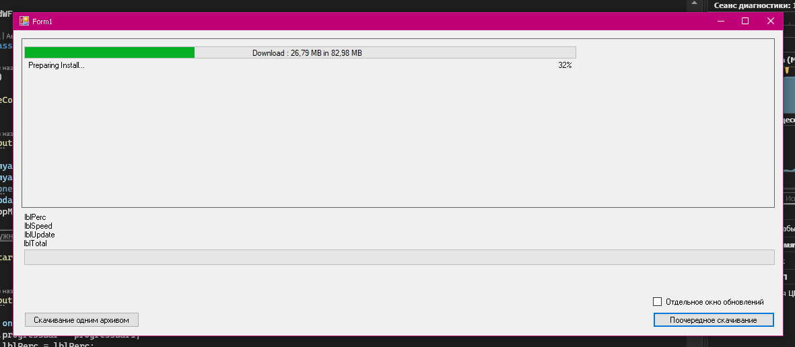
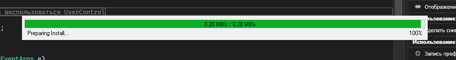
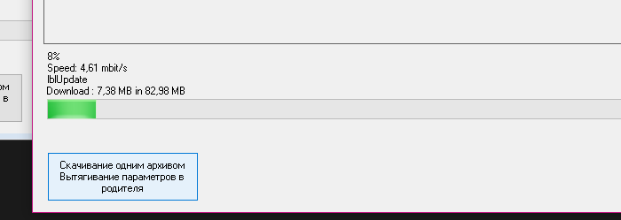

## UniUpdater
---
*  __Универсальная библиотека обновлений программ работающая через интернет__ 
*  __Минимальный размер библиотеки__
*  __Лёгок в использовании__
*  __Асинхронные методы обновления__
*  __Два вида обновления__


Всё просто
Параметры есть такие
* _/link_ - это текстовый файл на вашем сервере с ссылками на файлы которые необходимо скачать
* _/one_ - путь к файлу ОБНОВЛЕНИЙ.zip который нужно скачать
* _/FS_ - [FileStart] это какой файл будет запущен по завершению загрузки.


Если к примеру Вы указали параметр
```csharp
string[] myargs = { "/link|http://siteupdation.ru/link.txt", $"/FS|{Environment.CurrentDirectory}\\test.bat" };
```

1 строкой мы указываем корневую директорию, откуда будем брать файлы
а затем указываем с новой строки файлы в этой директории
```
http://siteupdation.ru/upd12_13/
Launcher.deps.json
patcher/test.exe
Launcher.dll
Launcher.exe
Ookii.Dialogs.WinForms.dll
System.Resources.Extensions.dll
Launcher.runtimeconfig.dev.json
Launcher.runtimeconfig.json
EmbedResource.dll
NLog.dll
NLog.config
patcher/Launcher_Property.xml
```

И если у Вас есть поддиректория в обновлении как в примере __patcher/Launcher_Property.xml__, но в целевой папке её нет, она будет создана автоматически.

Так же теперь можно записать всё в один архив и поместить на сервер (если в обновлении много файлов с поддиректориями) это кстати и сподвигло меня написать такое, так как в моём обновлении я добавил CefSharp а там куча файлов и поддиректорий.

Вызвать скачивание одним архивом можно как параметром _/one|Путь_к_файлу.zip_
Так и файлом откуда берём файл, а пишем так
```csharp
string[] myargs = { "/link|http://siteupdation.ru/link.txt", $"/FS|{Environment.CurrentDirectory}\\test.bat" };
```
__link.txt__ к которому путь (условно)
```
http://update.mysite.ru/launcher/update/
one|http://update.mysite.ru/launcher/update.zip
```

Пример использования в проекте
```csharp
//Пример с окошками
string[] myargs = { "/link|http://SITEUPDATION.ru/update/link.txt", $"/FS|{Environment.CurrentDirectory}\\test.bat" };
string[] myargs2 = { "/link|http://SITEUPDATION.ru/update/link2.txt", $"/FS|{Environment.CurrentDirectory}\\test.bat" };
string[] onearg = { "/one|http://SITEUPDATION.ru/lupdate/update.zip", $"/FS|{Environment.CurrentDirectory}\\test.bat" };
Updater updater = new Updater();
updater.TopMostWindow = true;
 
#region Если не нужно отдельного окна, а можно воспользоваться UserControl
 
if (!checkBox1.Checked)
    flowLayoutPanel1.Controls.Add(updater);
#endregion
 
updater.Start(onearg, chbWnd.Checked);
 
//Пример со считывание параметров
OneUpdate oneUpdate = new OneUpdate();
oneUpdate.progressBar = progressBar1;
oneUpdate.lblPerc = lblPerc;
oneUpdate.lblSpeed= lblSpeed;
oneUpdate.lblTotal= lblTotal;
oneUpdate.lblUpdate = lblUpdate;
 
oneUpdate.DownloadFile("http://SITEUPDATION.ru/update/update.zip", Environment.CurrentDirectory + "\\update.zip");
```

<details>
  <summary> немного скринов результата </summary>


 
 
 
 
</details>

